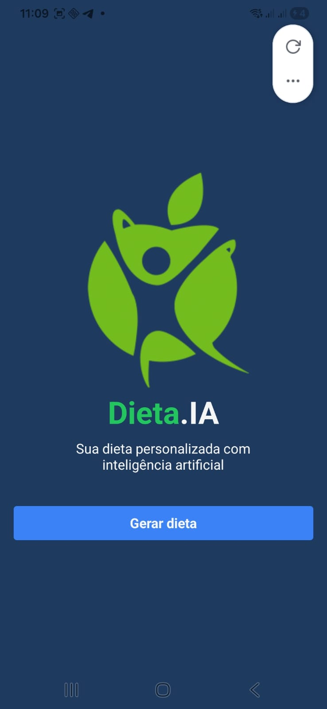
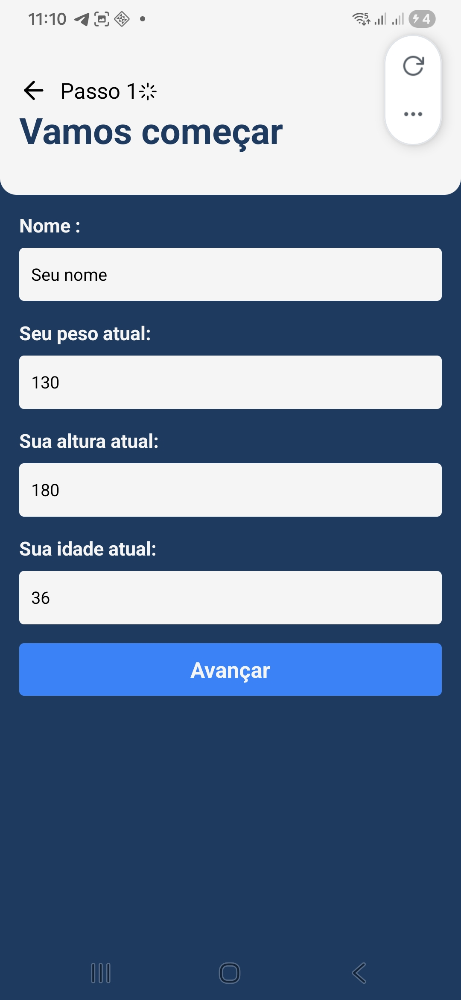
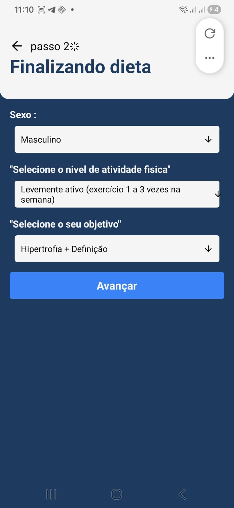
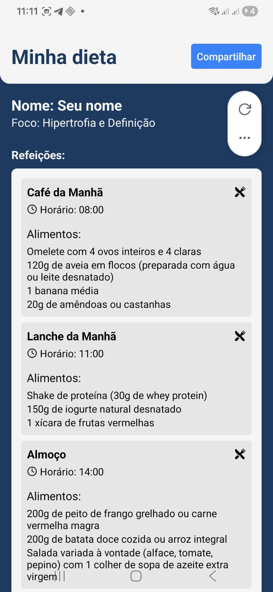

# 🥗 Dieta IA - Mobile App

Aplicativo mobile desenvolvido com **React Native, Expo e Inteligência Artificial (Gemini AI)** para gerar dietas personalizadas com base nos dados informados pelo usuário.

O sistema utiliza uma API própria desenvolvida com **Fastify** e integrada à **Gemini AI**, permitindo a criação automática de planos alimentares personalizados de forma rápida e intuitiva.

---

## 🚀 Tecnologias Utilizadas

### Mobile

- React Native
- Expo
- TypeScript
- Expo Router
- React Query
- Zustand
- Axios

### Backend

- Node.js
- Fastify
- TypeScript
- Railway

### Inteligência Artificial

- Gemini AI (Google)

---

## 📱 Funcionalidades

✅ Cadastro de informações físicas

✅ Geração automática de dietas com IA

✅ Sugestão de suplementação

✅ Compartilhamento da dieta

✅ Integração com API REST

✅ Interface responsiva

✅ Gerenciamento de estado com Zustand

✅ Backend hospedado na nuvem

✅ Integração com Inteligência Artificial Gemini

---

## 📥 Download do Aplicativo

📱 Instale o APK Android:

https://expo.dev/accounts/zenaldo/projects/Dieta-mobile/builds/95262f1b-a2c4-4227-8709-fa5574c90d8d

### QR Code para instalação

<p align="center">
 
</p>

---

## 📸 Screenshots

### 🏠 Tela Inicial



---

### 📝 Formulário



---

### ✍️ Formulário Preenchido


---

### 📋 Continuação do Formulário



---

### 🤖 Gerando Dieta com Inteligência Artificial


---

### 🥗 Resultado da Dieta Personalizada



---

## 📂 Estrutura do Projeto

```bash
app/
components/
services/
store/
assets/
constants/
types/
scripts/
```

---

## ⚙️ Instalação

Clone o repositório:

```bash
git clone https://github.com/zenaldo-oliveira/dieta-mobile.git
```

Acesse a pasta do projeto:

```bash
cd dieta-mobile
```

Instale as dependências:

```bash
npm install
```

Execute o projeto:

```bash
npx expo start
```

Ou execute diretamente no Android:

```bash
npm run android
```

---

## 🔗 Backend

API hospedada no Railway:

https://dieta-app-beckend-production.up.railway.app

Repositório Backend:

https://github.com/zenaldo-oliveira/dieta-app-beckend

---

## 🧠 Inteligência Artificial

O aplicativo utiliza a Gemini AI para gerar planos alimentares personalizados com base nos seguintes dados:

- Nome
- Sexo
- Peso
- Altura
- Idade
- Objetivo
- Nível de atividade física

A IA retorna:

- Plano alimentar completo
- Horários das refeições
- Sugestão de alimentos
- Recomendação de suplementos

---

## 🌐 Links

### 🚀 Portfólio

https://zenaldodev.com.br

### 💻 GitHub

https://github.com/zenaldo-oliveira

### 📱 Aplicativo

https://expo.dev/accounts/zenaldo/projects/Dieta-mobile/builds/95262f1b-a2c4-4227-8709-fa5574c90d8d

---

## 👨‍💻 Desenvolvedor

### Zenaldo Pereira de Oliveira

Desenvolvedor Full Stack especializado em:

- React
- Next.js
- React Native
- Node.js
- TypeScript
- APIs REST
- Inteligência Artificial

🌎 Portfólio:
https://zenaldodev.com.br

📧 Contato:
zenaldo_18@hotmail.com

🐙 GitHub:
https://github.com/zenaldo-oliveira

---

## ⭐ Apoie o Projeto

Se este projeto foi útil para você:

⭐ Deixe uma estrela no repositório.

🚀 Compartilhe com outros desenvolvedores.

💙 Contribuições são bem-vindas.

---

### Licença

Este projeto está sob a licença MIT.
